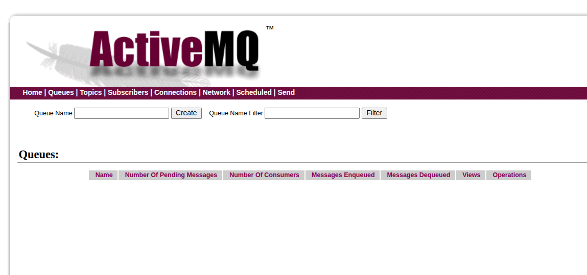
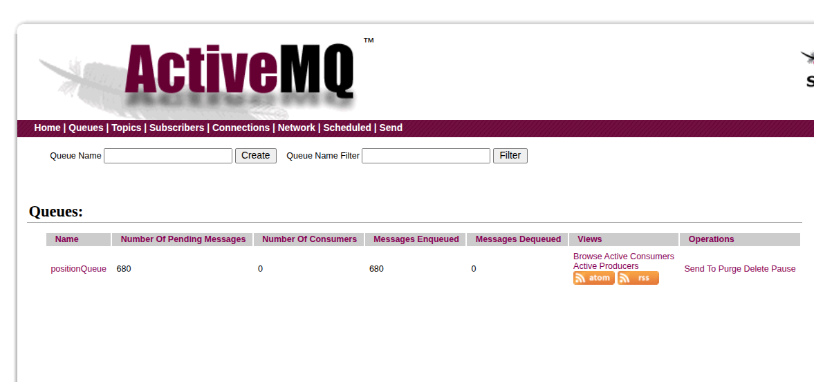
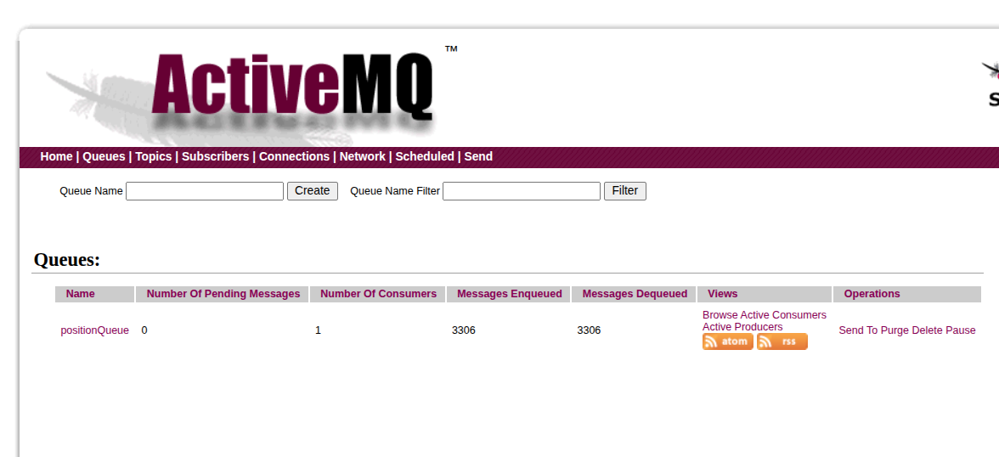

## Tester et déployer au fur et à mesure

### 1. Simuler un bug dans `position-tracker` et `position-simulator`

Dans un premier temps, nous allons **empêcher** le déploiement correct de ces deux pods pour vérifier que la file de messages reste vide.

Pour cela, commente les variables d’environnement des conteneurs dans ton fichier `workloads.yaml` :

```yaml
...
    spec:
      containers:
        - name: position-simulator
          image: richardchesterwood/k8s-fleetman-position-simulator:release1
          #env:
          #  - name: SPRING_PROFILES_ACTIVE
          #    value: production-microservice
...
    spec:
      containers:
        - name: position-tracker
          image: richardchesterwood/k8s-fleetman-position-tracker:release1
          ports:
            - containerPort: 8080
              name: tracker-port
          #env:
          #  - name: SPRING_PROFILES_ACTIVE
          #    value: production-microservice
```

L’objectif est que les pods `position-tracker` et `position-simulator` ne démarrent pas correctement, afin qu’aucun message ne soit produit ni consommé dans ActiveMQ.

Déploie la configuration :

```bash
kubectl apply -f workloads.yaml
```

Vérifie ensuite l’état des déploiements :

```bash
kubectl get deployment
```

Résultat attendu :

```
NAME                 READY   UP-TO-DATE   AVAILABLE   AGE
api-gateway          1/1     1            1           111s
position-simulator   0/1     1            0           111s
position-tracker     0/1     1            0           111s
queue                1/1     1            1           111s
webapp               1/1     1            1           111s
```

---

### 2. Exposer le service `fleetman-queue`

Expose le service ActiveMQ via Minikube pour accéder à son interface web :

```bash
minikube service fleetman-queue
```

Sortie attendue :

```
┌───────────┬────────────────┬────────────────┬───────────────────────────┐
│ NAMESPACE │      NAME      │  TARGET PORT   │            URL            │
├───────────┼────────────────┼────────────────┼───────────────────────────┤
│ default   │ fleetman-queue │ http/8161      │ http://192.168.49.2:30010 │
│           │                │ endpoint/61616 │ http://192.168.49.2:31405 │
└───────────┴────────────────┴────────────────┴───────────────────────────┘
```

Tu peux maintenant accéder à l’interface web d’**ActiveMQ** :

* **URL** : `http://192.168.49.2:30010`
* **Utilisateur** : `admin`
* **Mot de passe** : `admin`

La file de messages doit être **vide** :



---

### 3. Activer le pod `position-simulator`

Décommente uniquement les variables d’environnement du pod `position-simulator` afin de générer des messages dans la file ActiveMQ.

```yaml
...
    spec:
      containers:
        - name: position-simulator
          image: richardchesterwood/k8s-fleetman-position-simulator:release1
          env:
            - name: SPRING_PROFILES_ACTIVE
              value: production-microservice
...
```

Applique les changements :

```bash
kubectl apply -f workloads.yaml 
kubectl get deployment
```

Résultat attendu :

```
NAME                 READY   UP-TO-DATE   AVAILABLE   AGE
api-gateway          1/1     1            1           12m
position-simulator   1/1     1            1           12m
position-tracker     0/1     1            0           12m
queue                1/1     1            1           12m
webapp               1/1     1            1           12m
```

Dans l’interface **ActiveMQ**, tu verras que les compteurs **Messages Enqueued** et **Pending Messages** augmentent :



---

### 4. Activer le pod `position-tracker`

Enfin, décommente les variables d’environnement du pod `position-tracker` pour qu’il consomme les messages de la file.

```yaml
...
    spec:
      containers:
        - name: position-tracker
          image: richardchesterwood/k8s-fleetman-position-tracker:release1
          ports:
            - containerPort: 8080
              name: tracker-port
          env:
            - name: SPRING_PROFILES_ACTIVE
              value: production-microservice
...
```

Applique les changements :

```bash
kubectl apply -f workloads.yaml 
kubectl get deployment
```

Résultat attendu :

```
NAME                 READY   UP-TO-DATE   AVAILABLE   AGE
api-gateway          1/1     1            1           12m
position-simulator   1/1     1            1           12m
position-tracker     1/1     1            1           12m
queue                1/1     1            1           12m
webapp               1/1     1            1           12m
```

Dans l’interface **ActiveMQ**, tu verras que :

* Les messages en attente (**Pending Messages**) diminuent progressivement.
* Le champ **Number of Consumers** est désormais **supérieur à 0**, indiquant que `position-tracker` consomme bien les messages.



---

### 5. Tester l’accès à l’API REST de `position-tracker`

Pour tester l’accès à l’API REST du service `position-tracker`, il faut modifier le **type de service** `fleetman-position-tracker` de `ClusterIP` (valeur par défaut) à `NodePort`, afin de le rendre accessible depuis l’extérieur du cluster Minikube.

On définit également un **nodePort** fixe à `30030` :

```yaml
apiVersion: v1
kind: Service
metadata:
  name: fleetman-position-tracker
spec:
  selector:
    app: position-tracker
  ports:
    - name: http
      port: 8080
      targetPort: tracker-port
      nodePort: 30030
  type: NodePort
```

Grâce à cette configuration, le service `position-tracker` devient accessible depuis ton navigateur sur le port `30030`.

Déploie la configuration mise à jour :

```bash
kubectl apply -f workloads.yaml
```

Vérifie ensuite l’exposition du service :

```bash
minikube service fleetman-position-tracker
```

Résultat attendu :

```
┌───────────┬───────────────────────────┬─────────────┬───────────────────────────┐
│ NAMESPACE │           NAME            │ TARGET PORT │            URL            │
├───────────┼───────────────────────────┼─────────────┼───────────────────────────┤
│ default   │ fleetman-position-tracker │ http/8080   │ http://192.168.49.2:30030 │
└───────────┴───────────────────────────┴─────────────┴───────────────────────────┘
```

#### Test avec `curl`

Tu peux maintenant interroger l’API REST directement depuis ton terminal :

```bash
curl http://192.168.49.2:30030/vehicles/City%20Truck
```

Exemple de réponse :

```json
{
  "name": "City Truck",
  "lat": 53.372802939265966,
  "longitude": -1.4833488408476114,
  "timestamp": "2025-10-30T15:35:58.364+0000",
  "speed": 1.3915860532008044
}
```

#### Alternative : tester depuis un pod interne

Si tu préfères ne **pas exposer le service** en dehors du cluster, tu peux exécuter la commande `curl` depuis un pod interne, par exemple celui de `api-gateway`.

1. Accède à l’intérieur du pod :

   ```bash
   kubectl exec -it <nom-du-pod-api-gateway> -- sh
   ```

2. Installe `curl` (si non présent) :

   ```bash
   apk update
   apk add curl
   ```

3. Exécute la requête :

   ```bash
   curl http://fleetman-position-tracker:8080/vehicles/City%20Truck
   ```

Exemple de réponse interne :

```json
{
  "name": "City Truck",
  "lat": 53.37236523628235,
  "longitude": -1.4857687801122665,
  "timestamp": "2025-10-30T15:39:25.807+0000",
  "speed": 3.6718783796552876
}
```

---

### 6. Lancer les services `fleetman-api-gateway` et `fleetman-webapp`

Pour accéder à l’application complète, expose maintenant les services **API Gateway** et **Webapp** à l’aide de Minikube.

#### ➤ Exposer le service API Gateway

```bash
minikube service fleetman-api-gateway
```

Résultat attendu :

```
┌───────────┬──────────────────────┬─────────────┬───────────────────────────┐
│ NAMESPACE │         NAME         │ TARGET PORT │            URL            │
├───────────┼──────────────────────┼─────────────┼───────────────────────────┤
│ default   │ fleetman-api-gateway │ http/8080   │ http://192.168.49.2:30020 │
└───────────┴──────────────────────┴─────────────┴───────────────────────────┘
```

#### ➤ Exposer le service Webapp

```bash
minikube service fleetman-webapp
```

Résultat attendu :

```
┌───────────┬─────────────────┬─────────────┬───────────────────────────┐
│ NAMESPACE │      NAME       │ TARGET PORT │            URL            │
├───────────┼─────────────────┼─────────────┼───────────────────────────┤
│ default   │ fleetman-webapp │ http/80     │ http://192.168.49.2:30080 │
└───────────┴─────────────────┴─────────────┴───────────────────────────┘
```

Tu peux maintenant accéder à l’application via ton navigateur :
**Webapp** : [http://192.168.49.2:30080](http://192.168.49.2:30080)
**API Gateway** : [http://192.168.49.2:30020](http://192.168.49.2:30020)


## nslookup