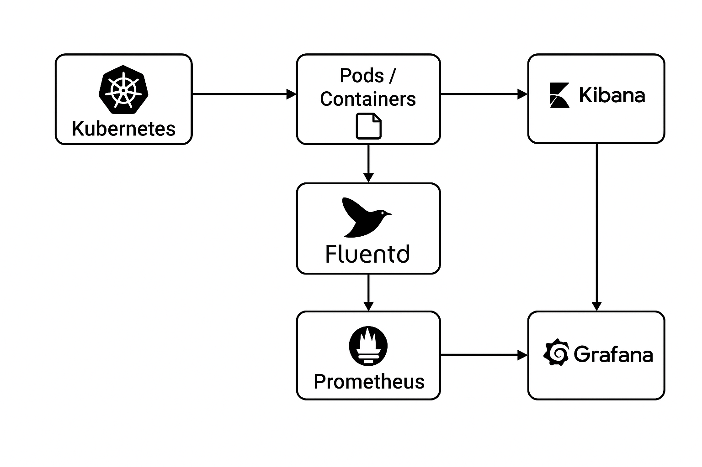

# Deployment of microservices on a Kubernetes architecture (Minikube & AWS EKS) with Elasticsearch/Kibana and Grafana/Prometheus



### Application de tracking et de suivi de livraison


## Schéma ASCII de l’architecture microservices

```
                        ┌────────────────────────────┐
                        │        Web Browser         │
                        │ (Interface utilisateur)    │
                        └────────────┬───────────────┘
                                     │
                        Requêtes HTTP│(ex: /api/vehicles)
                                     ▼
                        ┌────────────────────────────┐
                        │      Reverse Proxy         │
                        │         (nginx)            │
                        └────────────┬───────────────┘
                                     │
                                 /vehicles
                                     ▼
                        ┌────────────────────────────┐
                        │        API Gateway         │
                        │ Point d’entrée unique      │
                        │                            │
                        └────────────┬───────────────┘
                                 /vehicles
                                     ┼───────────────────┐
                                                         │
                                                         ▼
        ┌────────────────┐   ┌────────────────┐   ┌──────────────────┐
        │ Position       │   │    ActiveMQ    │   │ Position Tracker │
        │ Simulator      │──>│ (File de msgs) │<─>│ (Service métier) │
        │ (microservice) │   └────────────────┘   │ - Calcule vitesse│
        │ - Simule GPS   │                        │ - Historique pos.│
        │ - Publie msgs  │                        └──────────────────┘
        │   → ActiveMQ   │                                 │
        └────────────────┘                                 ▼
                                                         mongodb                                     
```

```
Relations logiques principales :
────────────────────────────────
position-simulator ──► queue ──► position-tracker ──► api-gateway ──► webapp ──► browser
                                 │
                                 ▼
                              mongodb (via mongo-pvc / cloud-ssd)
```

## Minikube
* 1. [Déploiement et tests sur Minikube](README-minikube-deploy.md)
* 2. [Diagnostic sur Minikube](README-diagnostic.md)
```bash
k8s/
├── base
│   ├── kustomization.yaml
│   ├── mongo.yaml
│   └── workloads.yaml
└── overlays
    ├── aws
    └── dev
        ├── kustomization.yaml
        └── storage.yaml
```

## AWS
* 1. [S'entraîner avec un déploiement AWS de test nginx](./aws-test/README.md)
* 2. [Déploiement de l'application sur Aws](./README-infra-aws.md)
```bash
k8s/
├── base
│   ├── kustomization.yaml
│   ├── mongo.yaml
│   └── workloads.yaml
└── overlays
    ├── aws
    │   ├── kustomization.yaml
    │   ├── logging
    │   │   ├── elk.yaml
    │   │   ├── fluentd.yaml
    │   │   └── kustomization.yaml
    │   └── storage.yaml
    └── dev
infra/
└── cluster.yaml
```

---

## Description des composants

### **Web Browser**

Interface front-end (Angular).
Il permet à l’utilisateur de visualiser la flotte de véhicules, leurs positions, vitesses, et historiques.
Toutes les requêtes du navigateur passent par le **Reverse Proxy**, qui les redirige vers le **API Gateway**.

### **Reverse Proxy (nginx)**

Composant d’infrastructure servant de point d’entrée HTTP.
Il :

* Redirige `/api/vehicles` vers l’API Gateway.
* Sert éventuellement les fichiers statiques du front-end.
* Joue un rôle de cache et de sécurité (filtrage, SSL, etc.).

### **API Gateway**

Point d’accès unique pour le front-end.
Il :

* Reçoit les requêtes REST du navigateur.
* Fait le routage logique vers les microservices adéquats (ici `/vehicles` → Position Tracker).
* Découple le front-end de la structure interne du backend, facilitant les évolutions.

### **Position Simulator (microservice)**

Microservice chargé de simuler des véhicules réels.
Il :

* Lit des fichiers contenant des coordonnées GPS prédéfinies.
* Génère périodiquement des positions.
* Envoie ces positions dans la **file de messages ActiveMQ**.
  C’est une source de données synthétiques qui reproduit le comportement de véhicules connectés.

### **ActiveMQ (Queue)**

Système de messagerie asynchrone.
Il :

* Reçoit les positions générées par le simulateur.
* Permet à d’autres microservices (comme le Position Tracker) de consommer ces messages.
* Assure la **découplage temporel** entre producteur (simulateur) et consommateur (tracker).

### **Position Tracker (microservice)**

Microservice principal côté backend.
Il :

* Consomme les messages de **ActiveMQ**.
* Calcule des informations dérivées (ex. vitesse, direction).
* Stocke ou expose l’historique des positions.
* Sert de point de référence pour l’API Gateway quand on interroge `/vehicles`.

### Fonctionnement global

1. Le **Position Simulator** envoie des positions GPS simulées dans **ActiveMQ**.
2. Le **Position Tracker** lit ces messages, les traite et stocke les résultats.
3. Le **API Gateway** reçoit les requêtes du front-end et les redirige vers le **Position Tracker**.
4. Le **Reverse Proxy (nginx)** agit comme point d’entrée HTTP, redirigeant vers le **API Gateway**.
5. L’utilisateur visualise les données en temps réel via le **Web Browser**.

---

## Schéma réseau Kubernetes (Logging + Monitoring)
```   
                                   ┌────────────────────────────────────────────┐
                                   │                NAMESPACE: default          │
                                   │────────────────────────────────────────────│
                                   │ Pods applicatifs                          │
                                   │  - stdout/stderr → /var/log/containers/*  │
                                   └──────────────────┬─────────────────────────┘
                                                      │
                                                      │ (log files on node)
                                                      ▼
      ┌───────────────────────────────────────────────────────────────────────────┐
      │                     NAMESPACE: logging                                    │
      │───────────────────────────────────────────────────────────────────────────│
      │                                                                           │
      │  ┌─────────────────────────────┐                                          │
      │  │ Fluent Bit (DaemonSet)      │                                          │
      │  │ - lit /var/log/containers   │                                          │
      │  │ - filtre kubernetes metadata│                                          │
      │  │ - expose /api/v1/metrics on │                                          │
      │  │   port 2020 (ServiceMonitor)│                                          │
      │  │ - output → Elasticsearch:9200 │                                        │
      │  └──────────────┬────────────────┘                                        │
      │                 │ HTTP (port 9200)                                        │
      │                 ▼                                                        │
      │  ┌─────────────────────────────┐                                          │
      │  │ Elasticsearch (StatefulSet) │                                          │
      │  │ - stocke les logs indexés   │                                          │
      │  │ - port 9200 (HTTP API)      │                                          │
      │  │ - port 9300 (transport)     │                                          │
      │  │ Service: elasticsearch-logging.logging.svc │                           │
      │  └──────────────┬────────────────┘                                        │
      │                 │ HTTP (9200)                                            │
      │                 ▼                                                        │
      │  ┌─────────────────────────────┐                                          │
      │  │ Kibana (Deployment)         │                                          │
      │  │ - se connecte à ES:9200     │                                          │
      │  │ - expose port 5601 (LoadBalancer) │                                    │
      │  │ UI accessible depuis l’extérieur │                                     │
      │  └─────────────────────────────┘                                          │
      │                                                                           │
      │  ┌─────────────────────────────┐                                          │
      │  │ ServiceMonitor (fluent-bit) │                                          │
      │  │ - Scrape /api/v1/metrics on │                                          │
      │  │   port 2020                 │                                          │
      │  │ - label release=kube-prometheus-stack │                                │
      │  └─────────────────────────────┘                                          │
      │                                                                           │
      └───────────────────────────────────────────────────────────────────────────┘
                                                      │
                                                      │ (ServiceMonitor detected)
                                                      ▼
      ┌───────────────────────────────────────────────────────────────────────────┐
      │                     NAMESPACE: monitoring                                 │
      │───────────────────────────────────────────────────────────────────────────│
      │                                                                           │
      │  ┌─────────────────────────────┐                                          │
      │  │ Prometheus (from helm chart)│                                          │
      │  │ - scrape metrics via ServiceMonitor │                                  │
      │  │ - port 9090 (LoadBalancer)  │                                          │
      │  │ - collecte metrics de:       │                                         │
      │  │   • K8s components           │                                         │
      │  │   • Fluent Bit               │                                         │
      │  │   • Node exporter            │                                         │
      │  └──────────────┬──────────────┘                                          │
      │                 │                                                        │
      │                 ▼                                                        │
      │  ┌─────────────────────────────┐                                          │
      │  │ Grafana (Deployment)        │                                          │
      │  │ - Datasource Prometheus     │                                          │
      │  │   → http://prometheus.monitoring:9090 │                                │
      │  │ - Datasource Elasticsearch  │                                          │
      │  │   → http://elasticsearch-logging.logging:9200 │                        │
      │  │ - expose port 3000 (LoadBalancer) │                                   │
      │  │ - Dashboards: logs + metrics │                                         │
      │  └─────────────────────────────┘                                          │
      │                                                                           │
      └───────────────────────────────────────────────────────────────────────────┘
```


### Explication simple du **flux de données**

#### 1. Logging

1. **Les pods** dans Kubernetes écrivent leurs logs dans `/var/log/containers/*.log`.
2. **Fluent Bit (DaemonSet)** lit ces fichiers (input `tail`), les enrichit avec des métadonnées Kubernetes (via le filtre `[FILTER] kubernetes`).
3. Fluent Bit envoie ces logs vers **Elasticsearch** (section `[OUTPUT] es` du ConfigMap).
4. **Elasticsearch** indexe et stocke les logs dans son cluster.
5. **Kibana** se connecte à Elasticsearch (via `ELASTICSEARCH_HOSTS`) et permet de visualiser, filtrer et explorer ces logs.

6. **But :** retrouver les logs d’un pod ou d’un namespace en temps réel.

#### 2. Monitoring

1. **Prometheus** (déployé via `kube-prometheus-stack`) récupère :
    * Les métriques des composants Kubernetes (`kubelet`, `api-server`, `node-exporter`, etc.)
    * Les métriques personnalisées des applications exposant `/metrics`
    * Les métriques de Fluent Bit (via ton `ServiceMonitor`)

2. **Grafana** (installé via Helm aussi) se connecte à :
    * **Prometheus** → pour les métriques système et cluster
    * **Elasticsearch** → pour les logs (tu l’as configuré comme datasource secondaire)

**But :** créer des dashboards corrélant métriques et logs :\
* Exemple : voir les erreurs 500 (logs) au même moment qu’un pic CPU (métrique Prometheus)

#### Communication entre composants

| Source     | Destination                | Protocole       | Rôle                           |
| ---------- | -------------------------- | --------------- | ------------------------------ |
| Pods       | Fluent Bit                 | file (hostPath) | Fournit les logs               |
| Fluent Bit | Elasticsearch              | HTTP 9200       | Envoie les logs indexés        |
| Kibana     | Elasticsearch              | HTTP 9200       | Lecture/visualisation des logs |
| Prometheus | Fluent Bit, K8s components | HTTP (scrape)   | Collecte métriques             |
| Grafana    | Prometheus                 | HTTP 9090       | Dashboards de métriques        |
| Grafana    | Elasticsearch              | HTTP 9200       | Dashboards de logs             |

#### Exemple de corrélation visuelle

Dans Grafana :

* Tu peux avoir un **dashboard de monitoring** basé sur Prometheus :

    * CPU, RAM, latence, disponibilité
* Et un **dashboard de logs** basé sur Elasticsearch :

    * Logs applicatifs, erreurs, requêtes

En combinant les deux, tu peux :

* Cliquer sur un pic CPU et voir les logs correspondants à ce moment.
* Créer des alertes basées sur les métriques Prometheus (via Alertmanager).

