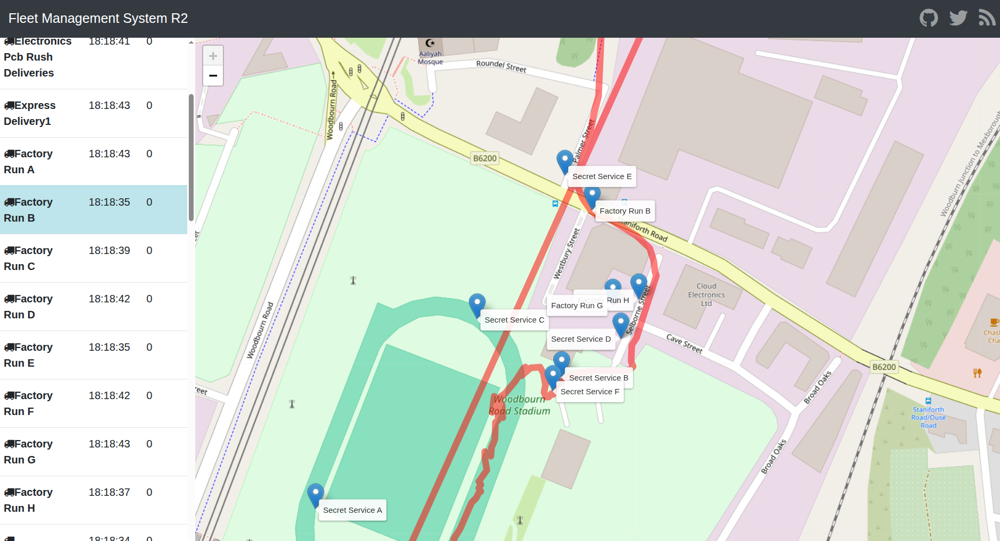

# kubernetes-aws-microservices

## Application de tracking et de suivi de livraison

([Déploiement et tests sur Minikube](README-deploy-test.md))\
([Diagnostic sur Minikube](README-diagnostic.md))



L’architecture **microservices** de cette application est basée sur les images Docker suivantes :

* [webapp-angular](https://hub.docker.com/r/richardchesterwood/k8s-fleetman-webapp-angular)
* [queue](https://hub.docker.com/r/richardchesterwood/k8s-fleetman-queue)
* [position-tracker](https://hub.docker.com/r/richardchesterwood/k8s-fleetman-position-tracker)
* [position-simulator](https://hub.docker.com/r/richardchesterwood/k8s-fleetman-position-simulator)
* [api-gateway](https://hub.docker.com/r/richardchesterwood/k8s-fleetman-api-gateway)


## Schéma ASCII de l’architecture microservices

```
                          ┌────────────────────────────┐
                          │        Web Browser         │
                          │ (Interface utilisateur)    │
                          └────────────┬───────────────┘
                                       │
                          Requêtes HTTP│(ex: /api/vehicles)
                                       ▼
                        ┌────────────────────────────┐
                        │      Reverse Proxy         │
                        │         (nginx)            │
                        └────────────┬───────────────┘
                                     │
                               /vehicles
                                     ▼
                        ┌────────────────────────────┐
                        │        API Gateway         │
                        │ Point d’entrée unique      │
                        │                            │
                        └────────────┬───────────────┘
                                 /vehicles
                                     ┼───────────────────┐
                                                         │
                                                         ▼
        ┌────────────────┐   ┌────────────────┐   ┌──────────────────┐
        │ Position       │   │    ActiveMQ    │   │ Position Tracker │
        │ Simulator      │──>│ (File de msgs) │<─>│ (Service métier) │
        │ (microservice) │   └────────────────┘   │ - Calcule vitesse│
        │ - Simule GPS   │                        │ - Historique pos.│
        │ - Publie msgs  │                        └──────────────────┘
        │   → ActiveMQ   │                                 │
        └────────────────┘                                 ▼
                                                         mongodb
                                      
                                     
```

## Description des composants

### **Web Browser**

Interface front-end (Angular).
Il permet à l’utilisateur de visualiser la flotte de véhicules, leurs positions, vitesses, et historiques.
Toutes les requêtes du navigateur passent par le **Reverse Proxy**, qui les redirige vers le **API Gateway**.

---

### **Reverse Proxy (nginx)**

Composant d’infrastructure servant de point d’entrée HTTP.
Il :

* Redirige `/api/vehicles` vers l’API Gateway.
* Sert éventuellement les fichiers statiques du front-end.
* Joue un rôle de cache et de sécurité (filtrage, SSL, etc.).

---

### **API Gateway**

Point d’accès unique pour le front-end.
Il :

* Reçoit les requêtes REST du navigateur.
* Fait le routage logique vers les microservices adéquats (ici `/vehicles` → Position Tracker).
* Découple le front-end de la structure interne du backend, facilitant les évolutions.

---

### **Position Simulator (microservice)**

Microservice chargé de simuler des véhicules réels.
Il :

* Lit des fichiers contenant des coordonnées GPS prédéfinies.
* Génère périodiquement des positions.
* Envoie ces positions dans la **file de messages ActiveMQ**.
  C’est une source de données synthétiques qui reproduit le comportement de véhicules connectés.

---

### **ActiveMQ (Queue)**

Système de messagerie asynchrone.
Il :

* Reçoit les positions générées par le simulateur.
* Permet à d’autres microservices (comme le Position Tracker) de consommer ces messages.
* Assure la **découplage temporel** entre producteur (simulateur) et consommateur (tracker).

---

### **Position Tracker (microservice)**

Microservice principal côté backend.
Il :

* Consomme les messages de **ActiveMQ**.
* Calcule des informations dérivées (ex. vitesse, direction).
* Stocke ou expose l’historique des positions.
* Sert de point de référence pour l’API Gateway quand on interroge `/vehicles`.

---

## Fonctionnement global

1. Le **Position Simulator** envoie des positions GPS simulées dans **ActiveMQ**.
2. Le **Position Tracker** lit ces messages, les traite et stocke les résultats.
3. Le **API Gateway** reçoit les requêtes du front-end et les redirige vers le **Position Tracker**.
4. Le **Reverse Proxy (nginx)** agit comme point d’entrée HTTP, redirigeant vers le **API Gateway**.
5. L’utilisateur visualise les données en temps réel via le **Web Browser**.

---
